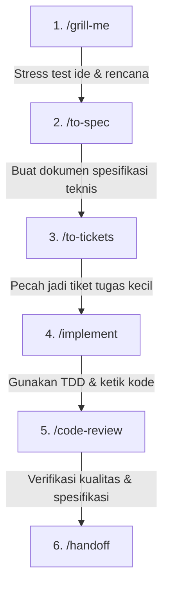

# PANDUAN PENGGUNAAN MATT POCOCK AGENT SKILLS

Panduan lengkap penggunaan **Matt Pocock Agent Skills** yang telah terinstall pada lingkungan **Antigravity**. Skills ini dirancang khusus untuk memandu AI Agent dalam menerapkan *real software engineering* (bukan sekadar *vibe coding*).

---

## 💡 Cara Kerja & Penggunaan Umum

Untuk mengaktifkan skill apa pun, Anda cukup mengetikkan **Slash Command** (contoh: `/grill-me`, `/tdd`, `/code-review`) atau menyebutkan kata kunci relevan dalam instruksi Anda kepada AI Agent.

---

## 🛠️ 1. KATEGORI ENGINEERING

Grup skill ini berfokus pada alur pengembangan perangkat lunak yang sistematis, teruji, dan berarsitektur bersih.

| Nama Skill | Fungsi Utama | Kapan Digunakan & Contoh Prompt |
| :--- | :--- | :--- |
| **`/to-spec`** | Mengubah ide/kebutuhan abstrak menjadi dokumen spesifikasi fitur teknis (`spec.md`) yang jelas. | **Kapan**: Sebelum menulis kode untuk fitur baru. **Prompt**: `/to-spec Buatkan spesifikasi teknis untuk fitur kalkulator harga di landing page.` |
| **`/to-tickets`** | Memecah spesifikasi (`spec.md`) menjadi daftar tiket/tugas kecil terstruktur. | **Kapan**: Setelah spesifikasi selesai dan ingin membagi tugas. **Prompt**: `/to-tickets Pecah spec kalkulator harga menjadi tiket-tiket task kecil.` |
| **`/grill-with-docs`** | Melakukan tanya-jawab kritis berdasarkan dokumentasi proyek untuk menutup celah desain. | **Kapan**: Ingin menguji apakah rencana fitur sesuai dengan arsitektur & dokumentasi yang ada. **Prompt**: `/grill-with-docs Uji rencana integrasi payment gateway ini dengan docs proyek.` |
| **`/implement`** | Eksekusi tiket/spesifikasi kode secara bertahap menggunakan prinsip TDD & regular typecheck. | **Kapan**: Saat siap membuat kode berdasarkan tiket/spec. **Prompt**: `/implement Kerjakan tiket #1 untuk pembuatan komponen kalkulator.` |
| **`/tdd`** | Pengembangan berbasis tes (*Test-Driven Development*: Red $\rightarrow$ Green $\rightarrow$ Refactor). | **Kapan**: Menambah fitur baru atau memperbaiki fungsi penting dengan kepastian tes. **Prompt**: `/tdd Buatkan fungsi perhitungan total estimasi biaya dengan pendekatan TDD.` |
| **`/code-review`** | Mereview perubahan kode (*WIP/PR*) berdasarkan standar repo dan spesifikasi awal. | **Kapan**: Setelah menyelesaikan suatu fitur sebelum merge/commit. **Prompt**: `/code-review Review perubahan kode pada komponen kalkulator harga.` |
| **`/diagnosing-bugs`** | Alur investigasi bug (*reproduce $\rightarrow$ isolate $\rightarrow$ fix $\rightarrow$ verify*). | **Kapan**: Ada error/bug yang sulit dilacak atau tes yang gagal. **Prompt**: `/diagnosing-bugs Perbaiki error saat user memilih lokasi hotel di kalkulator.` |
| **`/codebase-design`** | Merancang modul yang dalam (*deep modules*) dengan interface sederhana & menyembunyikan kompleksitas. | **Kapan**: Merancang struktur kelas/fungsi baru agar *maintainable* dan tidak bocor abstraction-nya. **Prompt**: `/codebase-design Rancang interface modul kalkulator paket renang agar clean.` |
| **`/improve-codebase-architecture`** | Mengidentifikasi *code smell* dan menyusun rencana refactoring arsitektur. | **Kapan**: Kode terasa berantakan, terlalu ramping (*shallow modules*), atau sulit dites. **Prompt**: `/improve-codebase-architecture Analisis struktur komponen proyek ini dan beri saran refactoring.` |
| **`/domain-modeling`** | Mempertajam istilah domain bisnis (*ubiquitous language*) dan mencatat keputusannya (ADR). | **Kapan**: Ingin menyelaraskan penamaan variabel & model sesuai istilah bisnis. **Prompt**: `/domain-modeling Buatkan model domain untuk entitas Paket Kursus dan Lokasi Kolam.` |
| **`/prototype`** | Membuat prototype cepat/throwaway untuk menguji validitas ide sebelum implementasi penuh. | **Kapan**: Ingin melihat eksplorasi logika/UI sebelum menulis kode produksi. **Prompt**: `/prototype Buat prototype cepat logika kalkulator semi-dynamic.` |
| **`/research`** | Melakukan riset mendalam pada repositori/dokumentasi luar dan menyimpannya sebagai file markdown. | **Kapan**: Perlu riset perpustakaan/API baru sebelum memutuskan solusi. **Prompt**: `/research Pelajari cara integrasi Tailwind dengan Vite untuk landing page.` |
| **`/triage`** | Memeriksa issue/bug baru, memberikan label, dan menentukan prioritas pengerjaan. | **Kapan**: Mengelola daftar masalah atau tiket baru yang masuk. **Prompt**: `/triage Tinjau daftar issue yang ada dan urutkan prioritasnya.` |
| **`/wayfinder`** | Memetakan struktur file, alur data, dan *entry point* penting dalam codebase. | **Kapan**: Baru membuka proyek baru atau ingin memahami alur aplikasi. **Prompt**: `/wayfinder Jelaskan alur data dan struktur file utama dalam proyek ini.` |
| **`/wizard`** | Membuat script bash interaktif untuk langkah-langkah manual yang hanya bisa dilakukan manusia. | **Kapan**: Menyiapkan credential, deployment, atau konfigurasi CI/CD. **Prompt**: `/wizard Buatkan wizard script untuk panduan setup env & deployment.` |

---

## 🗣️ 2. KATEGORI PRODUCTIVITY & COMMUNICATION

Grup skill ini berfokus pada klarifikasi kebutuhan, interview interaktif, wawancara keputusan, dan dokumentasi serah terima (*handoff*).

| Nama Skill | Fungsi Utama | Kapan Digunakan & Contoh Prompt |
| :--- | :--- | :--- |
| **`/grill-me`** / **`/grilling`** | Wawancara kritis tanpa henti untuk menguji rencana, ide, atau desain sebelum dieksekusi. | **Kapan**: Sebelum memulai proyek/fitur besar agar tidak ada asumsi yang terlewat. **Prompt**: `/grill-me Uji rencana saya untuk membuat landing page Aqualux.` |
| **`/handoff`** | Menulis catatan serah terima (`HANDOFF.md`) agar sesi berikutnya bisa melanjutkan pekerjaan tanpa *lost context*. | **Kapan**: Di akhir sesi kerja atau sebelum berganti fokus tugas. **Prompt**: `/handoff Buatkan rangkuman status pengerjaan saat ini untuk sesi berikutnya.` |
| **`/teach`** | Menjelaskan konsep teknis, pola kode, atau arsitektur secara bertahap dengan contoh interaktif. | **Kapan**: Ingin memahami cara kerja suatu algoritma atau konsep baru. **Prompt**: `/teach Jelaskan cara kerja state management di React untuk kalkulator.` |
| **`/to-questionnaire`** | Mengubah spesifikasi rumit menjadi daftar kuesioner terstruktur untuk klie/stakeholder. | **Kapan**: Perlu konfirmasi kebutuhan bisnis dari owner/klien. **Prompt**: `/to-questionnaire Buat daftar pertanyaan untuk pemilik Aqualux mengenai jadwal pelatih.` |
| **`/wait-what`** | Bertanya kembali secara kritis jika instruksi user membingungkan atau kontradiktif. | **Kapan**: Dipanggil otomatis saat instruksi user ambigu. |
| **`/writing-for-agents`** | Panduan menulis instruksi, prompt, dan panduan custom (`SKILL.md` / `AGENTS.md`) untuk AI Agent. | **Kapan**: Ingin membuat custom skill atau memperbaiki prompt agent. **Prompt**: `/writing-for-agents Bantu saya membuat custom skill baru.` |

---

## ⚡ 3. KATEGORI GENERAL & UTILITIES

Grup skill utilitas untuk konfigurasi environment, keamanan git, dan perkakas refactoring.

| Nama Skill | Fungsi Utama | Kapan Digunakan & Contoh Prompt |
| :--- | :--- | :--- |
| **`/setup-matt-pocock-skills`** | Menjalankan konfigurasi awal (opsi issue tracker, label, dan direktori docs). | **Kapan**: Dioperasikan 1x saat pertama kali mengonfigurasi proyek. **Prompt**: `/setup-matt-pocock-skills` |
| **`/setup-pre-commit`** | Memasang Husky pre-commit hooks dengan lint-staged, Prettier, dan typecheck. | **Kapan**: Menyiapkan otomatisasi format & cek tipe sebelum commit git. **Prompt**: `/setup-pre-commit Pasang pre-commit hook untuk format kode otomatis.` |
| **`/git-guardrails-claude-code`** | Menambahkan proteksi perintah Git berbahaya (`git push --force`, `git reset --hard`). | **Kapan**: Mencegah kehilangan data akibat perintah git yang tidak disengaja. **Prompt**: `/git-guardrails-claude-code Aktifkan proteksi git command di repo ini.` |
| **`/setup-ts-deep-modules`** | Menyetel aturan konfigurasi TypeScript untuk enkapsulasi modul yang dalam. | **Kapan**: Proyek TypeScript baru yang membutuhkan pembatasan ekspor modul. **Prompt**: `/setup-ts-deep-modules Atur konfigurasi tsconfig & aturan modul.` |
| **`/migrate-to-shoehorn`** | Mengganti *type assertion* `as` dalam unit test dengan `@total-typescript/shoehorn`. | **Kapan**: Merapikan unit test TypeScript agar tidak memakai type cast sembarangan. **Prompt**: `/migrate-to-shoehorn Refactor assertion 'as' di file tes kita.` |
| **`/scaffold-exercises`** | Membuat struktur direktori latihan kode lengkap dengan soal, stub, dan solusi. | **Kapan**: Membuat modul belajar atau materi workshop coding. **Prompt**: `/scaffold-exercises Buat modul latihan TypeScript.` |
| **`/ask-matt`** | Menanyakan saran arsitektur/pola TypeScript berdasarkan filosofi Matt Pocock. | **Kapan**: Bingung menentukan struktur tipe data atau *design pattern* TypeScript. **Prompt**: `/ask-matt Bagaimana cara terbaik mendesain discriminated unions untuk paket ini?` |

---

## 🔄 Contoh Alur Kerja Ideal (Recommended Workflow)

Berikut adalah alur pengerjaan fitur baru dari awal hingga selesai menggunakan kombinasi skill di atas:

1. **Rencanakan & Uji Ide**: Gunakan `/grill-me` agar AI menguji keputusan desain Anda.
2. **Buat Spesifikasi**: Jalankan `/to-spec` untuk menghasilkan dokumen `spec.md`.
3. **Bagi Tugas**: Jalankan `/to-tickets` untuk memecah spesifikasi menjadi tiket kerja.
4. **Eksekusi Fitur**: Gunakan `/implement` (secara otomatis memanfaatkan `/tdd`).
5. **Review Kode**: Evaluasi hasil akhir dengan `/code-review`.
6. **Simpan Progres**: Gunakan `/handoff` jika ingin mengakhiri sesi.
