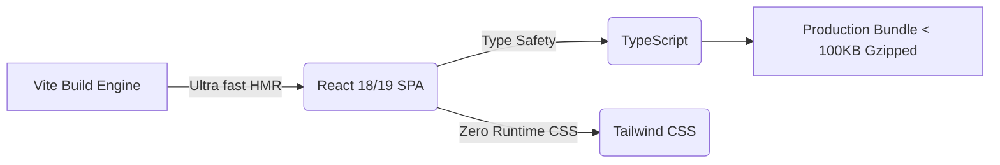
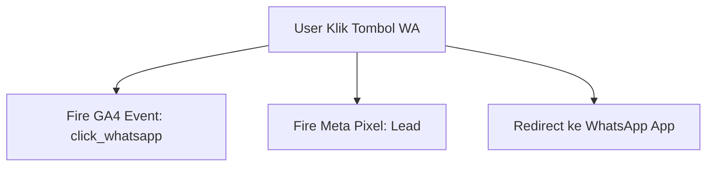

# DOKUMEN ARSITEKTUR TECH STACK & REKOMENDASI SISTEM
## Landing Page Conversion & Scalable System: AQUALUX Swimming Course

---

| Attributes | Details |
| :--- | :--- |
| **Project** | AQUALUX Swimming Course Landing Page |
| **Role** | Senior Software Architect |
| **Focus** | Conversion Rate Optimization (CRO), Fast Loading, Low Cost, Scalability |
| **Team Constraint** | 1–2 Developers (UMKM Scale) |
| **Target Rollout** | 2–4 Hari (MVP Mindset) |

---

## EXECUTIVE SUMMARY & REKOMENDASI UTAMA

Untuk kebutuhan bisnis **AQUALUX Swimming Course** saat ini (skala UMKM, budget efisien, butuh cepat launch, dan lead gen WhatsApp), stack utama yang direkomendasikan adalah:

> 🚀 **Vite + React (TypeScript) + Tailwind CSS + Vercel (Static Hosting)**

 Stack ini memberikan kombinasi sempurna antara **performa ekstrem (Score 95+ di Google PageSpeed)**, **biaya operasional Rp0/bulan (gratis hosting)**, **kalkulator interaktif tanpa bug**, dan **jalur skalabilitas mulus tanpa perlu membongkar kode** saat ingin menambah fitur booking/payment di masa depan.

---

## 1. FRONTEND TECH STACK

### 1.1 Rekomendasi Framework: Vite + React (TypeScript)



- **Mengapa Vite + React (SPA)?**
  - **Super Fast Development**: Cold-start server lokal $< 300\text{ms}$ dengan HMR (*Hot Module Replacement*) instan.
  - **Zero Cold-Start Delay di Production**: Karena merupakan *Single Page Application (SPA)* statis, HTML/JS/CSS di-cache 100% di CDN Edge secara global. Tidak ada jeda *serverless cold start* seperti pada Next.js SSR tier gratis.
  - **Ekosistem Melimpah**: Komponen UI, icon, dan library animasi sangat melimpah dan siap pakai.
- **Mengapa Menggunakan TypeScript?**
  - Mencegah bug fatal pada kalkulator harga (misalnya *type coercion* JavaScript di mana `"600000" + 25000` menjadi `"60000025000"`).
  - Memberikan kepastian struktur tipe data pada pilihan paket, lokasi, dan template pesan WhatsApp.
- **Mengapa Bukan Next.js untuk Fase 1?**
  - Next.js sangat powerful, namun untuk landing page 1 halaman tanpa kebutuhan blog/SEO ribuan halaman, Next.js menambahkan *overhead complexity* (seperti konfigurasi Server Components, SSR caching, dan ukuran node_modules besar).
  - *Catatan Skalabilitas*: Ketika nanti butuh backend/API di Fase 3, React bawaan Vite bisa ditransisikan atau ditambah Vercel Serverless Functions dengan sangat mudah.

### 1.2 Styling System: Tailwind CSS v4 / v3
- **Utility-First**: Mempercepat proses slicing desain UI dari PRD tanpa perlu membuat nama kelas CSS manual.
- **Zero Performance Penalty**: Tailwind menghapus (*purge*) semua CSS yang tidak terpakai saat build. Hasil akhir file CSS hanya berkisar **10KB – 15KB**.
- **Mobile-First Responsive**: Dukungan breakpoint bawaan (`sm:`, `md:`, `lg:`) mempermudah optimasi tampilan smartphone.
- **Helper Libraries**:
  - `lucide-react`: Library icon modern yang sangat ringan dan ter-tree-shake otomatis.
  - `framer-motion` (opsional): Untuk mikro-interaksi halus seperti efek *floating button* WA dan tombol kalkulator.

---

## 2. BACKEND STRATEGY (ZERO-BACKEND MVP PHASE)

### 2.1 Apakah Perlu Backend di Fase 1?
**TIDAK PERLU (Zero Backend Architecture).**

```
[User Browser] ---> (Client-side JS Calculator) ---> [Direct WhatsApp API Link]
```

### 2.2 Mengapa Tanpa Backend?
1. **Lead Generation Murni**: Konversi akhir landing page adalah membawa user berkomunikasi via WhatsApp. Tidak ada transaksi kartu kredit atau autentikasi akun di Fase 1.
2. **Kalkulator Harga Deterministik**: Logika perhitungan biaya privat/reguler + HTM kolam bersifat murni rumus matematika statis yang bisa dihitung 100% di browser client.
3. **Menghemat Biaya & Waktu**: Tanpa server backend, Anda menghemat biaya sewa server (VPS/Database) dan memangkas waktu pengerjaan backend API hingga 50%.

### 2.3 Rencana Transisi ke Backend (Fase 2 & 3)
Saat bisnis tumbuh dan membutuhkan **Sistem Booking Slot** atau **Payment Gateway**, backend akan ditambahkan tanpa merombak frontend:
- **Rekomendasi Backend Masa Depan**: **Supabase** (BaaS / Backend-as-a-Service berbasis PostgreSQL).
- **Alasan Supabase**: Memiliki Free Tier sangat besar (500MB DB, 50k pengguna aktif bulanan), menyediakan Auth, Database Realtime, dan Auto-generated REST/GraphQL API.

---

## 3. PRICING LOGIC IMPLEMENTATION (SEMI-DYNAMIC)

### 3.1 Arsitektur Perhitungan: Client-Side Pure Logic
Kalkulator harga dieksekusi 100% di sisi browser (*Client-Side*) menggunakan React State. Ini memberikan respon **realtime tanpa delay** ($0\text{ms}$ latensi jaringan) saat user mengklik pilihan lokasi/paket.

### 3.2 Data Structure & Calculation Formula

```typescript
// Data Pricing Matrix di Client-side
export const PRICING_DATA = {
  packages: {
    privat: {
      name: "Privat (1-on-1)",
      sessions: {
        4: { price: 600000, label: "4x Pertemuan" },
        8: { price: 1000000, label: "8x Pertemuan (Best Value)" }
      }
    },
    reguler: {
      name: "Reguler (3-4 Orang)",
      sessions: {
        4: { price: 400000, label: "4x Pertemuan" },
        8: { price: 600000, label: "8x Pertemuan (Best Value)" }
      }
    }
  },
  locations: {
    ubud: { name: "Hotel Ubud", htm: 25000, note: "HTM Kolam" },
    tychi: { name: "Hotel Tychi", htm: 30000, note: "HTM Kolam" },
    savana: { name: "Hotel Savana", htm: 50000, note: "HTM incl. Voucher Makan" }
  }
} as const;

// Rumus Perhitungan
export function calculateTotal(classType: 'privat' | 'reguler', sessions: 4 | 8, locationKey: 'ubud' | 'tychi' | 'savana') {
  const courseFee = PRICING_DATA.packages[classType].sessions[sessions].price;
  const htmPerSession = PRICING_DATA.locations[locationKey].htm;
  const totalHtm = htmPerSession * sessions;
  const grandTotal = courseFee + totalHtm;

  return { courseFee, htmPerSession, totalHtm, grandTotal };
}
```

---

## 4. HOSTING, DEPLOYMENT & ESTIMASI BIAYA

### 4.1 Platform Hosting: Vercel (Rekomendasi Utama)
- **Global CDN Edge Network**: File HTML/JS/CSS didistribusikan ke ratusan server di seluruh dunia. Waktu muat di Indonesia $< 1\text{ detik}$.
- **CI/CD Otomatis**: Cukup *connect* repositori GitHub. Setiap melakukan `git push`, Vercel akan otomatis melakukan *build & deploy* dalam hitungan detik.
- **HTTPS/SSL Gratis**: Sertifikat Let's Encrypt aktif otomatis.

### 4.2 Estimasi Biaya Operasional (Cost Breakdown)

| Komponen | Provider / Vendor | Estimasi Biaya (Rupiah) |
| :--- | :--- | :--- |
| **Hosting & CDN** | Vercel (Hobby Tier) | **Rp 0** / bulan (Gratis) |
| **SSL / HTTPS Certificate** | Vercel / Let's Encrypt | **Rp 0** / bulan (Gratis) |
| **Domain Web (`.my.id`)** | Niagahoster / Rumahweb / Cloudkilat | **~Rp 15.000 – Rp 25.000** / tahun |
| **Domain Web (`.com`)** (Opsional) | Namecheap / DomaiNesia | **~Rp 160.000** / tahun |
| **TOTAL ESTIMASI BIAYA OPERASIONAL** | | **~Rp 2.000 – Rp 15.000 / bulan** |

---

## 5. INTEGRASI WHATSAPP & ROTASI ADMIN

### 5.1 Dynamic WhatsApp Link Builder
Setiap kali kalkulator harga berubah, link tombol WhatsApp di-generate secara otomatis lengkap dengan teks pesan terformat (*URL Encoded*).

```typescript
export function buildWhatsAppUrl(
  phone: string,
  classType: string,
  sessions: number,
  locationName: string,
  courseFee: number,
  htmPerSession: number
): string {
  const message = `Halo Admin Aqualux, saya mau tanya/daftar kursus renang.\n\n` +
    `📌 *Pilihan Saya:*\n` +
    `• Paket: ${classType} (${sessions}x Pertemuan)\n` +
    `• Lokasi: ${locationName}\n` +
    `• Biaya Kursus: Rp ${courseFee.toLocaleString('id-ID')}\n` +
    `• Est. HTM Kolam: Rp ${htmPerSession.toLocaleString('id-ID')}/sesi\n\n` +
    `Apakah ada slot kosong minggu ini?`;

  return `https://wa.me/${phone}?text=${encodeURIComponent(message)}`;
}
```

### 5.2 Admin Rotation (Load Balancing Faqih & Abed)
Untuk membagi pesan masuk secara adil antara 2 nomor WA admin (Faqih: `6282142698440` & Abed: `628995911927`), kita gunakan logika **Weighted Random / Round-Robin** sederhana berbasis Client-side State/localStorage:

```typescript
const ADMIN_NUMBERS = [
  { name: 'Faqih', phone: '6282142698440' },
  { name: 'Abed', phone: '628995911927' }
];

export function getRotatedAdminPhone(): string {
  // Ambil counter dari storage atau pilih acak 50:50
  const lastIndex = parseInt(localStorage.getItem('aqualux_wa_index') || '0', 10);
  const nextIndex = (lastIndex + 1) % ADMIN_NUMBERS.length;
  localStorage.setItem('aqualux_wa_index', nextIndex.toString());
  
  return ADMIN_NUMBERS[nextIndex].phone;
}
```

---

## 6. ANALYTICS & CONVERSION TRACKING

Untuk mengukur efektivitas *lead generation*, dipasang tracking event sederhana menggunakan **Google Tag Manager (GTM)** atau **Google Analytics 4 (GA4)** & **Meta Pixel**.



### 6.1 Event Taxonomy (Matriks Tracking)

| Event Name | Trigger Condition | Parameter Data |
| :--- | :--- | :--- |
| `page_view` | Saat halaman dibuka | `source`, `medium`, `campaign` |
| `calculator_use` | User memilih paket / lokasi kolam | `class_type`, `location`, `sessions` |
| `click_wa_hero` | Klik CTA WhatsApp di Hero Section | `location_source: 'hero'` |
| `click_wa_calculator` | Klik CTA WhatsApp di Kalkulator Harga | `location_source: 'calculator'`, `estimated_total` |
| `click_wa_sticky` | Klik CTA WhatsApp di Sticky Mobile Bar | `location_source: 'sticky_bar'` |

---

## 7. SCALABILITY PLAN (ROADMAP BIAYA & ARSITEKTUR)

Stack awal (**Vite + React + Tailwind**) dirancang agar **TIDAK PERLU DIROMBAK TOTAL** ketika bisnis berkembang.

```
┌─────────────────────────────────────────────────────────────────────────┐
│ FASE 1 (SEKARANG) - MVP Lead Generation                                 │
│ Vite + React + Tailwind + Vercel Static (Tanpa Backend)                 │
└─────────────────────────────────────────────────────────────────────────┘
                                   │
                                   ▼
┌─────────────────────────────────────────────────────────────────────────┐
│ FASE 2 - System Booking Slot Realtime                                  │
│ Tambahkan Supabase BaaS (Database PostgreSQL & Realtime Slot API)       │
│ *Frontend React tetap sama, tinggal fetch data slot via API Supabase    │
└─────────────────────────────────────────────────────────────────────────┘
                                   │
                                   ▼
┌─────────────────────────────────────────────────────────────────────────┐
│ FASE 3 - Integration Payment Gateway (DP / Pelunasan)                  │
│ Tambahkan Vercel Serverless Function (/api/midtrans-checkout)           │
│ Integrasi Midtrans / Xendit Snap SDK di React                           │
└─────────────────────────────────────────────────────────────────────────┘
                                   │
                                   ▼
┌─────────────────────────────────────────────────────────────────────────┐
│ FASE 4 - Internal Admin Dashboard & Schedule Tracking                  │
│ Buat Route '/admin' di proyek React yang sama menggunakan React Router  │
│ Gunakan Supabase Auth (Login Admin) + Tabel Jadwal Siswa                │
└─────────────────────────────────────────────────────────────────────────┘
```

---

## 8. PERBANDINGAN ALTERNATIF STACK (MATRIX ANALYSIS)

Berikut adalah perbandingan 3 opsi arsitektur pengembangan untuk AQUALUX:

| Parameter | Opsi A: No-Code (Wordpress / Wix / Elementor) | Opsi B: Low-Code (Framer / Webflow) | Opsi C: Full-Code (Vite + React + Tailwind) ⭐ RECOMMENDED |
| :--- | :--- | :--- | :--- |
| **Kecepatan Launch MVP** | ⚡ Sangat Cepat (1–2 Hari) | ⚡ Cepat (2–3 Hari) | 🚀 Cepat (2–4 Hari) |
| **Kecepatan Muat PageSpeed** | 🐢 Lambat – Sedang (Score 40–70) | 🚀 Cepat (Score 80–90) | ⚡ **Ekstrem Cepat (Score 95–100)** |
| **Fleksibilitas Kalkulator** | ❌ Terbatas (Butuh plugin berbayar) | ⚠️ Butuh Custom Code Embed | ✅ **100% Bebas Kustomisasi Logic** |
| **Biaya Bulanan (Hosting)** | 💵 $10–$25 / bulan (Rp 150k-400k) | 💵 $15–$25 / bulan (Rp 250k-400k) | 🆓 **Rp 0 / bulan (Vercel Free Tier)** |
| **Kemudahan Scaling (Fase 2-4)**| ❌ Sulit & Rawan Conflict Plugin | ⚠️ Terbatas pada Integrasi Webhook | ✅ **Mudah (Tinggal tambah Supabase/API)**|
| **Ketergantungan Vendor** | 🔴 Tinggi | 🔴 Tinggi | 🟢 **Sangat Rendah (Bisa dipindah kapan saja)**|

### Kesimpulan Rekomendasi
Pilihlah **Opsi C (Vite + React + Tailwind)** karena memberikan performa tercepat, fleksibilitas logika kalkulator 100%, **biaya operasional Rp0/bulan**, dan kesiapan skalabilitas masa depan tanpa ketergantungan pada vendor pihak ketiga.

---

### Approval & Sign-Off Block

| Role | Name | Status | Date |
| :--- | :--- | :--- | :--- |
| **Senior Software Architect** | AI Architect | Approved | 08 Aug 2026 |
| **Lead Developer** | Pending Review | Ready for Setup | - |
| **Business Owner (Aqualux)** | Pending Review | Ready for Execution | - |
