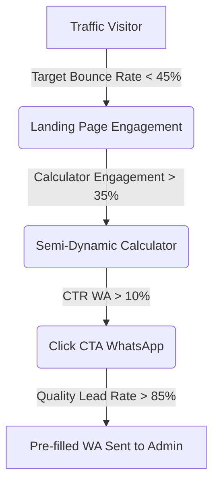
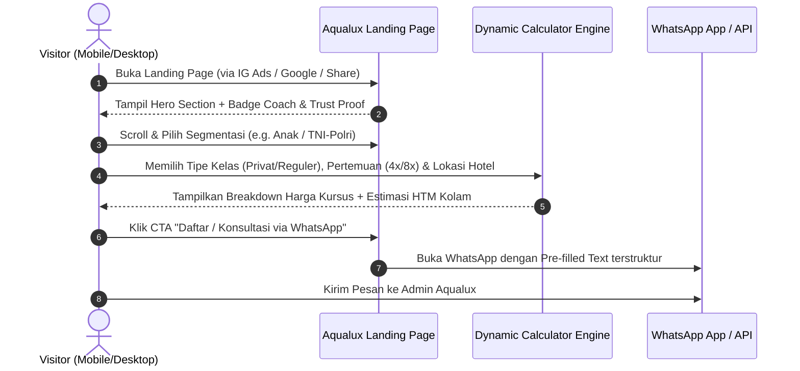
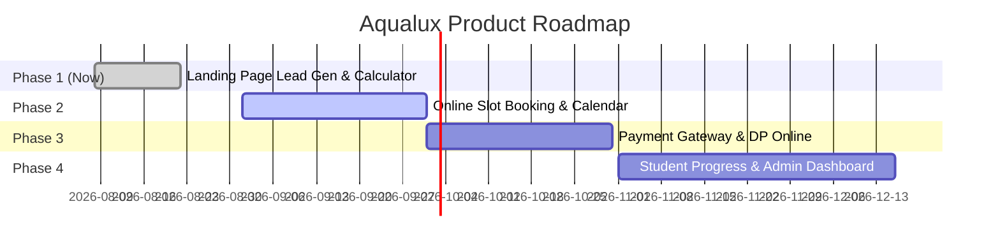

# PRODUCT REQUIREMENT DOCUMENT (PRD)
## Conversion-Oriented Landing Page: AQUALUX Swimming Course

---

| Document Attributes | Detail |
| :--- | :--- |
| **Product Name** | AQUALUX Swimming Course Landing Page |
| **Document Version** | v1.0 (Production-Ready Spec) |
| **Author** | Senior Product Manager |
| **Target Audience** | UI/UX Designers, Frontend Developers, Copywriters, Marketing & Admin Team |
| **Primary Goal** | Lead Generation via WhatsApp with High Conversion Rate |

---

## 1. PRODUCT OVERVIEW

### 1.1 Deskripsi Produk
Landing page AQUALUX Swimming Course adalah web landing page satu halaman (*single-page app*) yang didesain khusus berbasis **conversion rate optimization (CRO)** untuk mengonversi pengunjung (traffic dari ads, sosmed, atau pencarian lokal) menjadi **hot leads di WhatsApp**.

Landing page ini tidak sekadar berfungsi sebagai "brosur digital", melainkan platform interaktif transparan yang mengedukasi calon peserta, menyederhanakan perhitungan biaya (kursus + tiket kolam), membangun kepercayaan (*trust*), dan mengarahkan user mengambil tindakan dengan pesan WhatsApp terstruktur.

### 1.2 Value Proposition Utama
1. **Coach Berprestasi & Bersertifikat**: Pelatih pemenang kejuaraan renang (Popda & Kejurnas Finswimming Jatim) dengan metode mengajar yang aman, ramah anak, dan terstruktur.
2. **Program Fleksibel & Tersegmentasi**: Menyediakan kelas dari tingkat pemula/takut air (anak 5+ & dewasa) hingga persiapan fisik intensif tes TNI/Polri.
3. **Transparansi Harga Semi-Dynamic**: Tidak ada biaya tersembunyi. User dapat menghitung estimasi total biaya kursus + HTM kolam renang secara realtime sebelum menghubungi WhatsApp.
4. **Lokasi Kolam Premium & Nyaman**: Bermitra dengan hotel-hotel pilihan (Ubud Hotel, Tychi Hotel, Savana Hotel) yang bersih, terawat, dan kondusif untuk belajar.

### 1.3 Target User
- **Orang Tua (Usia 28–45 th)**: Mencari kursus renang aman & menyenangkan untuk anak usia 5+ th.
- **Pelajar & Remaja (Usia 12–18 th)**: Ingin mahir berenang untuk kebugaran atau hobi.
- **Dewasa (Usia 19–40 th)**: Ingin belajar renang dari 0, mengatasi trauma air, atau terapi kesehatan.
- **Calon Peserta Tes TNI/Polri/Kedinasan (Usia 17–23 th)**: Butuh perbaikan teknik renang dan pencapaian target waktu tes ketangkasan renang.

---

## 2. PROBLEM STATEMENT & GAP ANALYSIS

| Masalah Saat Ini (Existing State) | Dampak Bisnis / Friction User | Solusi Produk pada Landing Page Baru |
| :--- | :--- | :--- |
| **1. LP Mirip Poster / Brosur PDF** | Informasi padat, tidak interaktif, tidak menarik di mobile device, bounce rate tinggi. | Layout modern *mobile-first* dengan hirarki visual jelas, micro-interactions, dan visual storytelling. |
| **2. Pricing Statis & Membingungkan** | User bingung membedakan biaya les dan biaya tiket masuk kolam (*HTM*). Sering bertanya hal yang sama di WA. | **Semi-Dynamic Pricing Calculator** yang memisahkan biaya kursus & estimasi HTM kolam per lokasi secara transparan. |
| **3. Trust & Social Proof Belum Optimal** | Orang tua ragu akan keamanan anak; calon TNI/Polri ragu efektivitas waktu. | Penonjolan Badge Prestasi Pelatih, testimoni orang tua/alumni, video/foto suasana latihan, serta garansi metode bertahap. |
| **4. Tidak Ada Urgency Mechanism** | User menunda-nunda menghubungi admin (berakhir lupa/pindah ke kompetitor). | Widget *Limited Slot Indicator* per lokasi dan penawaran terbatas. |
| **5. Alur WhatsApp Tidak Terstruktur** | Chat WA masuk hanya berupa "Halo", admin butuh waktu lama untuk follow-up data dasar. | **Dynamic WA Link Generator** dengan pesan otomatis berformat (*pre-filled template*) berisi nama paket, lokasi, & preferensi hari. |

---

## 3. GOALS & SUCCESS METRICS (KPI)

### 3.1 Primary Goal
Meningkatkan jumlah leads berkualitas tinggi yang masuk ke WhatsApp Admin AQUALUX dengan konversi visitor-to-lead minimum **8% - 12%**.

### 3.2 Key Performance Indicators (KPIs)



- **Visitor-to-WA Conversion Rate (CTR)**: $\ge 10\%$ dari total session.
- **Pricing Calculator Engagement Rate**: $\ge 35\%$ visitor mencoba memfilter/menghitung biaya.
- **Quality Lead Ratio**: $\ge 85\%$ pesan WA yang masuk menggunakan *pre-filled template* lengkap.
- **Mobile Page Speed Score (Google PageSpeed)**: Performance Score $\ge 90$, LCP $< 2.5\text{ detik}$.
- **Average Time on Page**: $\ge 1.5\text{ menit}$.

---

## 4. USER PERSONAS

### Persona 1: Ibu Ratna (34 Tahun) — Parents/Anak
- **Role**: Ibu Rumah Tangga / Pekerja Kantor (Punya anak usia 6 tahun).
- **Goal**: Anak bisa berenang, tidak takut air, dan mengisi waktu luang secara positif & sehat.
- **Pain Point**: Takut anak tenggelam, khawatir pelatih galak/kasar, bingung total biaya kolam.
- **Trigger Key**: Melihat foto/video melatih anak dengan sabar, sertifikat pelatih, dan kejelasan lokasi hotel yang bersih.

### Persona 2: Bagas (20 Tahun) — Calon Pendaftar TNI/Polri
- **Role**: Lulusan SMA / Mahasiswa.
- **Goal**: Lolos ujian ketangkasan renang tes TNI/Polri (harus bisa renang gaya dada 50 meter dengan waktu cepat).
- **Pain Point**: Waktu seleksi tinggal 2-3 bulan lagi, teknik renang salah sehingga cepat lelah, butuh pelatih profesional berpengalaman.
- **Trigger Key**: Prestasi coach kejuaraan daerah/nasional, program khusus persiapan tes, rekomendasi kelas privat intensif.

### Persona 3: Dini (28 Tahun) — Dewasa Pemula
- **Role**: Pekerja Profesional.
- **Goal**: Belajar renang dari nol untuk olahraga dan menghilangkan stres tanpa merasa malu.
- **Pain Point**: Malu berenang di kelas yang banyak anak kecil/ramai, trauma air masa kecil.
- **Trigger Key**: Pilihan kelas Privat 1-on-1, privat di hotel yang tenang, penyesuaian pace belajar sesuai kemampuan.

---

## 5. USER JOURNEY & CONVERSION FLOW



### Pre-filled WhatsApp Template Logic
Ketika user menekan tombol CTA WhatsApp dari Landing Page, link WA akan berisi pesan terformat otomatis:

> *"Halo Admin Aqualux, saya tertarik daftar kursus renang.*
> 
> 📌 **Detail Pilihan Saya:**
> - **Kategori**: [Anak 5+ / Pelajar / Dewasa / TNI-Polri]
> - **Tipe Kelas**: [Privat (1 Orang) / Reguler (3-4 Orang)]
> - **Jumlah Pertemuan**: [4x / 8x Pertemuan]
> - **Pilihan Lokasi**: [Ubud Hotel / Tychi Hotel / Savana Hotel]
> - **Estimasi Total Kursus**: Rp [Harga Kursus] *(belum incl. HTM Kolam Rp [HTM]/sesi)*
> 
> *Bisa bantu cek ketersediaan jadwal coach minggu ini?"*

---

## 6. INFORMATION ARCHITECTURE (IA)

Landing Page didesain menggunakan skema **Single Page Scrolling** dengan susunan hirarki berikut:

```
┌─────────────────────────────────────────────────────────┐
│ 1. HEADER & STICKY NAVBAR                               │
│    Logo Aqualux | Nav Links | Quick Call CTA             │
├─────────────────────────────────────────────────────────┤
│ 2. HERO SECTION                                         │
│    Headline | Subheadline | Badge Trust | Primary CTA   │
├─────────────────────────────────────────────────────────┤
│ 3. SOCIAL PROOF & PRESTASI COACH                        │
│    Kejurnas & Popda Medals | Total Murid | Rating       │
├─────────────────────────────────────────────────────────┤
│ 4. SEGMENTASI PROGRAM KURSUS                            │
│    Anak 5+ | Pelajar | Dewasa | Persiapan TNI/Polri     │
├─────────────────────────────────────────────────────────┤
│ 5. LOKASI BIMBINGAN & JADWAL                            │
│    Ubud Hotel | Tychi Hotel | Savana Hotel              │
├─────────────────────────────────────────────────────────┤
│ 6. SEMI-DYNAMIC PRICING & CALCULATOR (INTERAKTIF)       │
│    Toggle Kelas | Select Pertemuan | Select Lokasi      │
│    Realtime Breakdown Card | Secondary WA CTA           │
├─────────────────────────────────────────────────────────┤
│ 7. WHY CHOOSE US (KEUNGGULAN)                           │
│    Kurikulum Bertahap | Safety First | Evaluasi        │
├─────────────────────────────────────────────────────────┤
│ 8. TESTIMONIAL & PROOF OF OUTCOME                       │
│    Story Before-After | Parent Reviews | TNI/Polri Pass │
├─────────────────────────────────────────────────────────┤
│ 9. URGENCY & LIMITED SLOT BANNER                        │
│    Sisa Slot Privat Bulan Ini | Countdown Promo         │
├─────────────────────────────────────────────────────────┤
│ 10. FAQ (FREQUENTLY ASKED QUESTIONS)                    │
│     Accordion Tanya-Jawab seputar Tiket, Reschedule, dll│
├─────────────────────────────────────────────────────────┤
│ 11. FOOTER & STICKY BOTTOM WA BAR (MOBILE)              │
│     Legal Info | Sosmed Links | Floating WA Button      │
└─────────────────────────────────────────────────────────┘
```

---

## 7. DETAILED FEATURE REQUIREMENTS

### 7.1 Header & Sticky Navigation
- **Requirement**: Bar navigasi atas yang tetap (*sticky*) saat scroll.
- **Elemen UI**:
  - Logo AQUALUX Swimming Course.
  - Link Navigasi Desktop: Program, Lokasi, Harga, Testimoni, FAQ.
  - Button CTA: "Konsultasi WA" (Warna Hijau WhatsApp `#25D366` / Brand Accent).
- **Logic**: Di tampilan mobile, navigasi disederhanakan menjadi Logo + Button WhatsApp Mini.

### 7.2 Hero Section (High Conversion Focus)
- **Headline (H1)**: *"Dari Takut Air, Jadi Jago Berenang & Percaya Diri!"*
- **Subheadline**: *"Kursus Renang Privat & Reguler bersama Pelatih Juara Kejurnas. Aman, Terstruktur, dan Hasil Terbukti untuk Anak hingga Persiapan TNI/Polri."*
- **Visual**: Foto High-Quality pelatih mengajar anak/peserta renang di kolam hotel yang bersih (*mood: ceria, aman, profesional*).
- **Trust Badges (Pill Component)**:
  - 🏅 *Pelatih Berprestasi Jatim*
  - 🏊‍♂️ *99% Berhasil dalam 8 Sesi*
  - 🛡️ *Fokus Teknik & Keselamatan*
- **CTA Utama**:
  - Button 1 (Primary): "Hitung Biaya & Ambil Slot WA" (Scroll smooth ke Kalkulator Harga).
  - Button 2 (Secondary): "Lihat Lokasi & Jadwal".

### 7.3 Section Prestasi Pelatih (Social Proof Bar)
- **Tujuan**: Menghilangkan keraguan atas kualitas pelatih.
- **Konten**:
  - 🥇 *Juara 1 Estafet Putra Popda Finswimming Jatim 2022*
  - 🥈 *Juara 2 Estafet Mix Kejurnas Piala Gubernur Jatim 2023*
  - 🥉 *Juara 3 Estafet Putra Porprov Finswimming Jatim 2023*
- **UI Spec**: Banner horizontal dengan badge medali beranimasi halus (*counter counter-up / slick icon card*).

### 7.4 Section Segmentasi Program
- **Tujuan**: User langsung menemukan kategori yang sesuai dengan kebutuhan mereka.
- **Card Interactive (4 Tab/Card)**:
  1. **Anak 5+ Th**: Pendekatan ramah anak, diajarkan dari *water orientation*, mengapung, hingga gaya dasar.
  2. **Pelajar & Remaja**: Pembentukan stamina, perbaikan gaya renang, hobi & kebugaran.
  3. **Dewasa (Pemula / Advanced)**: Privasi terjaga, jadwal fleksibel, mengatasi trauma air.
  4. **Persiapan Tes TNI / Polri / Kedinasan**: Program intensif fisik, perbaikan waktu renang 50m gaya dada, tips lolos ujian.

### 7.5 Section Lokasi Bimbingan & HTM Kolam
- **Tujuan**: Transparansi tempat dan jadwal latihan.
- **Card Lokasi (3 Kolam Hotel)**:
  - **Hotel Tychi**:
    - Hari: Senin – Jumat | Jam: 06.00 – 17.00 WIB
    - Tiket Masuk (HTM): Rp30.000 / kedatangan
  - **Hotel Savana**:
    - Hari: Senin, Rabu, Kamis, Jumat | Jam: 06.00 – 17.00 WIB
    - Tiket Masuk (HTM): Rp50.000 / kedatangan *(Bonus Paket Makan/Minum Hotel)*
  - **Hotel Ubud**:
    - Hari: Setiap Hari / Sesuai Kesepakatan | Jam: 06.00 – 17.00 WIB
    - Tiket Masuk (HTM): Rp25.000 / kedatangan
- **Interactive Map / Info Note**: Menyediakan petunjuk peta Google Maps dan penegasan bahwa tiket kolam dibayarkan langsung di lokasi kolam.

---

## 8. PRICING SYSTEM & CALCULATOR (FITUR KRUSIAL)

### 8.1 Konsep Pricing: Semi-Dynamic Pricing
Untuk menyelesaikan masalah kebingungan user mengenai "Berapa total yang harus saya bayar?", landing page menggunakan **Kalkulator Interaktif Semi-Dynamic**.

```math
\text{Total Estimasi Biaya} = \text{Biaya Kursus (Aqualux)} + (\text{HTM Kolam Hotel} \times \text{Jumlah Pertemuan})
```

### 8.2 Data Pricing Base Matrix

| Tipe Kelas | Pertemuan | Durasi / Sesi | Harga Kursus (Aqualux) | Harga Sesi per Pertemuan |
| :--- | :--- | :--- | :--- | :--- |
| **Privat** (1 Orang) | 4x Pertemuan | 1 Jam 15 Menit | **Rp600.000** | Rp150.000 / sesi |
| **Privat** (1 Orang) | 8x Pertemuan | 1 Jam 15 Menit | **Rp1.000.000** *(Hemat 200k)* | Rp125.000 / sesi |
| **Reguler** (3-4 Orang) | 4x Pertemuan | 1 Jam 15 Menit | **Rp400.000** | Rp100.000 / sesi |
| **Reguler** (3-4 Orang) | 8x Pertemuan | 1 Jam 15 Menit | **Rp600.000** *(Hemat 200k)* | Rp75.000 / sesi |

#### Matrix HTM Kolam Hotel (Per Kedatangan):
- **Hotel Ubud**: Rp25.000 / sesi
- **Hotel Tychi**: Rp30.000 / sesi
- **Hotel Savana**: Rp50.000 / sesi *(Termasuk voucher makan/minum)*

### 8.3 Wireframe & UX Specs Kalkulator Harga

```
┌────────────────────────────────────────────────────────────────────────┐
│ 🧮 KALKULATOR ESTIMASI BIAYA KURSUS AQUALUX                           │
│ Hitung transparan biaya kursus + tiket kolam sesuai lokasi pilihanmu   │
├────────────────────────────────────────────────────────────────────────┤
│ 1. Pilih Tipe Kelas:                                                   │
│    (o) Privat (1-on-1)           ( ) Reguler (3-4 Orang)              │
│                                                                        │
│ 2. Pilih Jumlah Pertemuan:                                             │
│    [ 4 Pertemuan ]               [ 8 Pertemuan (Best Value!) ]         │
│                                                                        │
│ 3. Pilih Lokasi Kolam Renang:                                          │
│    [ Hotel Ubud (HTM 25k) ] [ Hotel Tychi (30k) ] [ Hotel Savana (50k) ]│
├────────────────────────────────────────────────────────────────────────┤
│ 📊 RINCIAN BIAYA & ESTIMASI:                                           │
│ ---------------------------------------------------------------------- │
│ • Biaya Kursus Aqualux (8x Privat)   : Rp 1.000.000                   │
│ • Estimasi HTM Hotel Tychi (8x @30k)  : Rp   240.000 (Dibayar di kolam)│
│ ---------------------------------------------------------------------- │
│ 💰 TOTAL ESTIMASI PENGELUARAN         : Rp 1.240.000                   │
│                                                                        │
│ 💡 Catatan: Biaya kursus Rp1.000.000 ditransfer ke Aqualux.            │
│             Tiket kolam Rp30.000 dibayar langsung di loket hotel.      │
│                                                                        │
│ [ 💬 AMBIL SLOT & KONSULTASI VIA WHATSAPP (1-CLICK) ]                  │
└────────────────────────────────────────────────────────────────────────┘
```

### 8.4 Logika Perhitungan JavaScript (Dev Spec)
```javascript
// Pseudo Code untuk Kalkulator Dynamic
function calculateAqualuxPackage(classType, sessions, locationKey) {
  const courseRates = {
    privat: { 4: 600000, 8: 1000000 },
    reguler: { 4: 400000, 8: 600000 }
  };
  
  const poolFees = {
    ubud: { name: 'Hotel Ubud', fee: 25000 },
    tychi: { name: 'Hotel Tychi', fee: 30000 },
    savana: { name: 'Hotel Savana', fee: 50000, note: 'Termasuk makan/minum' }
  };

  const courseFee = courseRates[classType][sessions];
  const poolFeePerSession = poolFees[locationKey].fee;
  const totalPoolFee = poolFeePerSession * sessions;
  const totalEstimatedCost = courseFee + totalPoolFee;

  return {
    courseFee,
    poolFeePerSession,
    totalPoolFee,
    totalEstimatedCost,
    waLink: generateWALink(classType, sessions, poolFees[locationKey].name, courseFee, poolFeePerSession)
  };
}
```

---

## 9. UX REQUIREMENTS & CONVERSION DESIGN PRINCIPLES

### 9.1 Design System & Palette (Aesthetic Guidance)
- **Primary Color**: Deep Ocean Blue (`#0F4C81`) — Melambangkan profesionalisme, air, dan kepercayaan.
- **Secondary / Cyan Accent**: Cyan Water (`#00A8E8`) — Memberikan kesan segar dan dinamis.
- **Conversion CTA Color**: Bright WhatsApp Green (`#25D366`) & Vibrant Coral Amber (`#FF6B35`) untuk kontras tinggi pada tombol aksi.
- **Typography**: Google Fonts **Outfit** (Heading) & **Inter** (Body text) untuk legibilitas maksimal di layar hp.

### 9.2 Sticky Mobile Bottom CTA Bar
Di perangkat mobile ($\le 768\text{px}$), bagian bawah layar akan memunculkan **Floating Action Bar** permanen:
- Teks: *"Butuh info jadwal & slot privat?"*
- Tombol: **"Chat Admin WA"** (Icon WhatsApp, efek denyut / micro-pulse animation).

### 9.3 Friction Reduction Techniques
- **Tanpa Form Isian Panjang**: Menghilangkan input form email/nama di web yang memperlambat user. Direct 1-click ke WhatsApp.
- **Visual Hierarchy**: Penggunaan ukuran font tebal (*bold*), kartu terpisah (*card UI*), dan icon kontras tinggi.
- **Micro-Copy**: Menambahkan kalimat penguat seperti *"Bisa konsultasi dulu gratis"* atau *"Jadwal fleksibel menyesuaikan kamu"*.

---

## 10. NON-FUNCTIONAL REQUIREMENTS (NFR)

### 10.1 Responsiveness (Mobile-First)
- UI dirancang dan diuji pada resolusi mobile 360px – 430px terlebih dahulu sebelum desktop.
- Touch target area pada tombol minimal **48px x 48px** agar mudah ditekan jari.

### 10.2 Performance & Speed
- **Zero Heavy Library**: Utamakan HTML5, Vanilla CSS / Tailwind, dan Lightweight JS.
- **Image Optimization**: Format gambar wajib WebP/AVIF dengan kompresi maksimal tanpa mengurangi kejernihan (max total page size $< 1.5\text{ MB}$).
- **Lazy Loading**: Terapkan `loading="lazy"` pada gambar di bawah hero section.

### 10.3 SEO Fundamental & Open Graph
- **Title Tag**: `AQUALUX Swimming Course - Kursus Renang Privat & Reguler Malang`
- **Meta Description**: `Kursus renang terbaik untuk anak, remaja, dewasa & persiapan TNI/Polri. Pelatih juara Kejurnas. Jadwal fleksibel di Hotel Tychi, Savana & Ubud.`
- **Open Graph Image**: Banner visual Aqualux dengan tombol play/logo saat link dibagikan di WhatsApp/Facebook.
- **Structured Data (JSON-LD)**: Schema type `Course` & `LocalBusiness`.

---

## 11. EDGE CASES & MITIGATION PLAN

| Potential Edge Case | Problem Scenario | Mitigation / Solution Spec |
| :--- | :--- | :--- |
| **1. User Bingung Pembayaran Tiket** | User mengira harga kursus sudah termasuk tiket kolam atau sebaliknya. | Beri *callout box* kuning/biru terang di kalkulator: *"Tiket kolam dibayarkan langsung di loket hotel per datang, bukan ke Aqualux."* |
| **2. User Tidak Tahu Rute Kolam** | User belum pernah ke Hotel Tychi/Savana/Ubud. | Sediakan tombol *"Buka di Google Maps"* pada setiap card lokasi. |
| **3. Keraguan Anak Takut Air** | Orang tua khawatir anaknya menangis dan tidak mau masuk kolam pada sesi 1. | Sediakan FAQ & Jaminan: *"Coach kami berpengalaman menangani anak trauma/takut air dengan metode pendekatan ramah tanpa paksaan."* |
| **4. Admin WA Overload / Slow Response** | Ada 2 nomor WA (Faqih & Abed), berpotensi menumpuk di 1 nomor. | Buat sistem **WA Rotation Script** sederhana (menggilir link antara nomor Faqih & Abed secara acak 50:50). |

---

## 12. FUTURE IMPROVEMENTS (PRODUCT ROADMAP)



- **Fase 1 (Current Scope)**: Landing Page Conversion + Dynamic Pricing Calculator + WA Generator.
- **Fase 2 (Booking System)**: Integrasi kalender sisa slot coach secara realtime, user bisa memilih tanggal & jam sesi langsung di web.
- **Fase 3 (Payment Gateway)**: Integrasi Midtrans / Xendit untuk pembayaran DP 50% atau Pelunasan Paket via QRIS / Bank Transfer.
- **Fase 4 (Student Dashboard)**: Dashboard progress siswa untuk melihat catatan evaluasi perkembangan teknik dari coach setelah sesi selesai.

---

### Approval & Sign-Off Block

| Role | Name | Status | Date |
| :--- | :--- | :--- | :--- |
| **Lead Product Manager** | Senior PM | Approved | 08 Aug 2026 |
| **UI/UX Designer Lead** | Pending Review | Ready for Design | - |
| **Lead Frontend Developer**| Pending Review | Ready for Sprint | - |
| **Business Owner (Aqualux)**| Pending Review | Ready for Sign-off | - |
